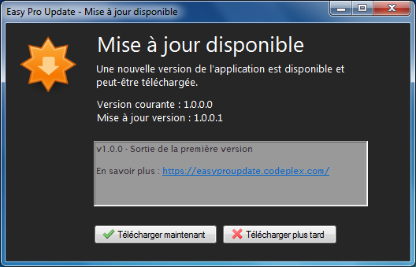
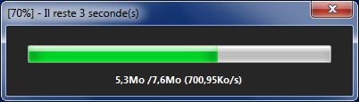

**Description**

**Easy Pro Update** est un système de mise à jour, qui a pour but de mettre à jour vos application sur plusieurs plateformes (C#, VB.NET..) mais il peut être utilisé sur plusieurs type d'application (WindowsForm, WPF, Console..). Un développeur pourra insérer **Easy Pro Update** facilement et rapidement sur ses applications qu'il veut mettre à jour régulièrement. En effet il sera facile pour lui de changer de version, de mettre les notes de versions afin d'informer l'utilisateur du contenue de la mise à jour. Côté utilisateur, il sera facilement compréhensible, rapide d'utilisation et informé à tout moment.

**_Easy Pro Update_ ne possède que deux fenêtres pour mettre à jour vos applications :**

Une fenêtre pour avertir l'utilisateur qu'une mise à jour est disponible avec son contenu :

Et une fenêtre pour informer l'utilisateur de la progression du téléchargement de la mise à jour : 

Ainsi, **Easy Pro Update** mettra à jour vos applications de n'importe quels autres langages, ou autres plateformes de fenêtres et prendra en compte le choix de l'utilisateur ("**Télécharger maintenant**" ou "**Télécharger plus tard**"). 

**N'attendez plus et venez découvrir la souplesse de _Easy Pro Update_.**