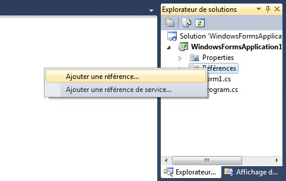
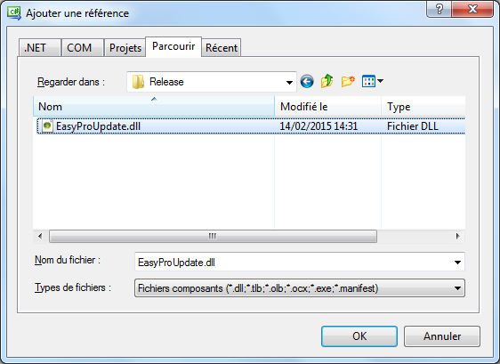
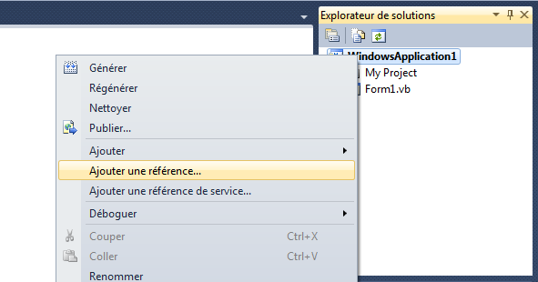
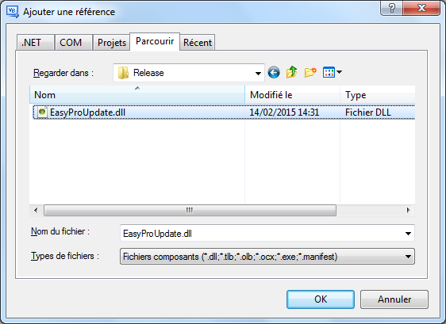

**Nous voici maintenant dans la partie qui sera consacrée à l'installation de Easy Pro Update.**

# I - Passons à la première étape (Détermination d'une mise à jour disponible ou pas) :

#### 1. Après avoir télécharger le fichier EasyProUpdate.zip, ouvrez-le et extrayiez tout les fichiers dans un dossiers vierge.

#### 2. Dans le dossier EasyProUpdate.zip, il y a un fichier XML nommé Fichier-Mise-A-Jour.xml ce fichier contiendra le nom des fenêtres de l'updater, la version de la mise à jour, l'URL du fichier à télécharger et le journal des modifications de la mise à jour.

Voici le contenu de Fichier-Mise-A-Jour.xml :

{code:xml}
<?xml version="1.0" encoding="utf-8"?>
<item>
   <title>Titre des fenêtres de l'updater</title>                    <!-- Titre de l'updater -->
   <version>1.0.0.0</version>                                        <!-- Version de la mise à jour -->
   <url>http://ton-site.fr/Updater/Nouvelle-version.exe</url>        <!-- URL du téléchargement de la mise à jour -->
   <changelog>v1.0.0 - Sortie de la première version</changelog>     <!-- Journal de modifications -->
</item>
{code:xml}

#### 3. Après avoir modifier ce fichier pour votre application, vous pouvez maintenant le publier dans votre site.

# II - Maintenant nous allons aborder la dernière partie à suivre pour installer la librairie sur vos applications :

#### 1. Ouvrez le projet de votre application à mettre à jour, puis ajouter une référence et importer le fichier EasyProUpdate.dll.

Pour un projet C# :

Pour un projet VB.NET :

#### 2. Allez dans le code de la fenêtre principale de votre application, et inscrivez les écritures ci-dessous : 

Pour un project C# :

{code:c#}
using EasyProUpdate; //Importation de la librairie

    public partial class Form1 : Form
    {
        public Form1()
        {
            InitializeComponent();
        }

        private void BT_UPDATE_Click(object sender, EventArgs e)
        {
            EPUpdate.Start("http://ton-site.fr/Updater/Fichier-Mise-A-Jour.xml"); //Action mise à jour
        }
    }
{code:c#}

Pour un project VB.NET :

{code:vb.net}
Imports EasyProUpdate 'Importation de la librairie

Public Class Form1

    Private Sub BT_UPDATE_Click(sender As System.Object, e As System.EventArgs) Handles BT_UPDATE.Click
	
	EPUpdate.Start("http://ton-site.fr/Updater/Fichier-Mise-A-Jour.xml") 'Action mise à jour

    End Sub
End Class
{code:vb.net}

**Voilà c'est fini !** Vous savez maintenant comment utilisé **Easy Pro Update** sur vos application **;)**.